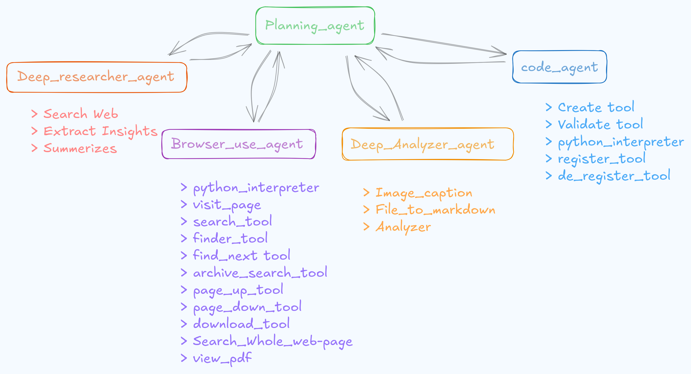

<div align="center" ></div>


<div align="center">


</div>

---

<div align="center">

  <a href="https://www.youtube.com/watch?v=IuKkCtJ6tYI">
    

  click Video to view Demo
    
  </a>
  
# HyDRA: Hierarchical Deep Researcher Agent
</div>


## Content Navigation

* [Project Overview](#project-overview)
* [Architecture Overview](#heirarchial-multi-agent-architecture)
* [Project Structure](#project-structure)
* [Benchmark Results](#benchmark-results)
* [Reuirements](#requirements)
* [Setup and Reproducibility](#setup-and-reproducibility)
* [Evaluation](#evaluation)
* [Project Status](#status)

---

## Project Overview

**HyDRA (Hierarchical Deep Researcher Agent)** is an agentic research framework designed to execute complex, multi-step information-seeking and reasoning tasks with high reliability. It combines hierarchical agent delegation, strict action–observation execution loops, and aggressive context management to prevent failure modes commonly observed in long-horizon LLM workflows.

At its core, HyDRA separates **planning**, **execution**, **research**, and **synthesis** into well-defined agents and tools. Each component operates under strict output contracts (JSON-only actions), ensuring deterministic downstream processing and eliminating ambiguity during tool invocation.

A central **Context Manager** continuously validates, summarizes, and minimizes tool and agent outputs. This makes HyDRA resilient to:

* Context window exhaustion
* Tool output verbosity
* JSON decoding failures due to context pollution

HyDRA is designed for:

* Deep web and archive research
* Benchmark-driven evaluation (GAIA, SimpleQA, HLE)
* Structured, verifiable final answers
* Extensibility via modular toolchains

The system is suitable for research automation, evaluation of reasoning agents, and experimentation with hierarchical agent architectures.

---

## Heirarchial Multi-agent Architecture
<div align="center">
    
</div>

### Delegation and Response Flow

```python
Action: [Planning_agent > Managed_agent]

    {
      name: <agent_name>,
      task: <delegated_task>
    }

Final_answer: [Planning_agent < Managed_agent]

    {
      answer: <observation_from_managed_agent>
    }
```

HyDRA follows a **hierarchical, contract-driven agent architecture** with strict separation of concerns.

### 1. High-Level Flow

1. **Planning Agent**

   * Interprets the task
   * Delegates actions to managed agent while overviewing every observations to solve user's task

2. **Execution Agents**

   * `browser_use_agent`: Handles live web interaction
   * `deep_researcher_agent`: Performs multi-source synthesis and deeper reasoning with web-use
   * `deep_analyzer_agent`: Analyze the source (files / images) with given task. [*In Progress*]
   * `code_agent`: Creates tools as function dynamically and puts then into agent context which they can use using given `python_interpreter` tool  [*In Progress*]
   * Agents operate in an Action → Observation loop

3. **Tool Layer**

   * Web search, visti page navigation, archive search, Python execution
   * Each tool produces validated outputs

4. **Context Manager**

   * Intercepts every tool and agent output=
   * Summarizes verbose outputs
   * Minimizes context when token limits are reached

5. **Final Answer Tool**

   * Produces a single, structured final response
   * Terminates execution deterministically

---

### 2. Context Management Strategy (Key Differentiator)

The **Context Manager** provides three critical functions:

* **Validate**

  * Ensures tool/agent outputs conform to expected formats
  * Prevents invalid data from propagating

* **Summarize**

  * Compresses long tool outputs into task-relevant facts
  * Preserves decision-critical information only

* **Minimize**

  * Shrinks historical context using validation rules
  * Automatically triggered when context budget is exceeded

---

### 3. Failure Handling and Robustness

HyDRA implements explicit and layered failure-handling mechanisms to mitigate common failure modes in long-horizon agentic workflows.

**1. Context Pollution Prevention**
Tools may occasionally return verbose, poorly structured, or markdown-heavy outputs that can pollute the agent context and degrade downstream reasoning.

* **Mitigation**:
  * Every tool output is validated before being appended to the observation history. Invalid or low-signal outputs are filtered, summarized, or rejected, preventing unnecessary noise from entering the context.

**2. Non-Valid Structured Output from Models**
Some instruction-following models—particularly freely available Groq-hosted models—may emit malformed or non-structured outputs, including mismatched tool arguments or broken JSON, especially under polluted or compressed context conditions.

* **Mitigation**:

  * System summarize the most recent context segment; if the issue persists, remove the last context entry entirely.
  * Enforce a maximum retry allowed per model invocation.
  * If repeated attempts fail to recover valid output, the affected agent instance is terminated while the overall system continues execution. The Planning Agent can re-delegate the task to an alternative agent or execution path.

**3. Context Limit Management**
When the context window approaches its limit, HyDRA proactively reduces context size.

* **Mitigation**:
    * The Context Manager shrinks historical context to a minimal, information-preserving representation that retains key facts, decisions, and constraints required for task continuation.

These mechanisms substantially improve robustness in long-running research tasks. While failures may still occur due to external constraints such as request-rate exhaustion or rare Planning Agent errors, such failures are isolated and do not compromise the stability of the overall system.

---

## Project Structure

```text
.
├── src/                         # Core agent implementation
│   ├── agent.py                 # Entry point for the hierarchical research agent
│   ├── core/                    # Agent core logic
│   │   ├── agent.py             # Base Agent logic
│   │   ├── context_manager.py   # Context and token budget management: validate tool output, minimize context, summerize particular agent / tool output
│   │   ├── state.py             # Agent state representation
│   │   ├── utils.py             # Shared utilities
│   │   └── prompts/             # Prompt templates (YAML + Markdown)
│   ├── tools/                   # Tooling layer used by the agent
│   │   ├── registry.py          # Tool registration logic
│   │   ├── registry.yaml        # Tool configuration
│   │   ├── tools_registry.py    # Tool resolution and dispatch
│   │   ├── deep_researcher/     # Deep research toolchain
│   │   ├── archive_searcher/    # Academic / archive search tools
│   │   ├── web_browser/         # Web interaction and parsing tools
│   │   ├── python_interpreter/  # Local Python execution tool
│   │   └── final_answer.py      # Final answer tool
│   └── tool_builder.py          # Tools registry construction
│
├── Evaluation_Suite/             # Evaluation and benchmarking framework
│   ├── evaluation_gaia.py        # GAIA benchmark
│   ├── evaluation_simpleQA.py    # SimpleQA benchmark
│   ├── evaluation_hle.py         # HLE benchmark
│   ├── evaluation_utils.py       # Shared evaluation utilities
│   ├── evaluation_config.yaml   # Evaluation configuration
│   └── Evaluation_results/      # Stored evaluation outputs
│
├── notebooks/                    # Analysis and benchmarking notebooks
├── docs/                         # Project documentation
├── app.py                        # Frontend demo backend
├── Dockerfile                    # Containerized execution environment
├── requirements.txt              # Python dependencies
├── README.md                     # Project documentation
└── LICENSE                       # License
```

## Requirements

### API Keys

The following environment variables are required to run or evaluate the agent:

| Variable         | Description                                       |
| ---------------- | ------------------------------------------------- |
| `GROQ_API_KEY`   | Primary agent inference                           |
| `GROQ_API_KEY_2` | Context manager (token-efficient planning)        |
| `GROQ_BASE_URL`  | Groq API base URL                                 |
| `HF_TOKEN`       | Hugging Face token (required for evaluation only) |

Example:

```bash
    export GROQ_API_KEY=your_key_here
    export GROQ_API_KEY_2=your_key_here
    export GROQ_BASE_URL=https://api.groq.com
    export HF_TOKEN=your_hf_token_here
```
---
## Setup and Reproducibility


This mutli-agent is **fully reproducible** and can be run in an isolated virtual environment with no cached dependencies.

### Quickstart [Run the Agent]

```bash
    # Create and activate a virtual environment
    python -m venv .venv
    source .venv/bin/activate

    # Set required environment variables
    export GROQ_API_KEY="your_key_here"
    export GROQ_API_KEY_2="your_key_here"
    export GROQ_BASE_URL="https://api.groq.com"


    # Install dependencies without caching (low disk usage)
    python -m pip install --no-cache-dir -r requirements.txt

    # Run the agent
    python src/agent.py
```
---

### Start With UI [Run the Agent]

```bash
    # Create and activate a virtual environment
    python -m venv .venv
    source .venv/bin/activate

    # Set required environment variables
    export GROQ_API_KEY="your_key_here"
    export GROQ_API_KEY_2="your_key_here"
    export GROQ_BASE_URL="https://api.groq.com"

    # OPTION 1: Without Docker
    # Install dependencies without caching (low disk usage)
    python -m pip install --no-cache-dir -r requirements.txt

    # Run the server
    uvicorn app:app --host 0.0.0.0 --port 10000  
    
    # OPTION 2: Run Using Docker
    docker build --no-cache --progress=plain -t app:latest .
    docker run -p 10000:10000 app:latest

    # Run Frontend
    git clone https://github.com/Se00n00/Chat/tree/main
    git checkout Hydra
    npm install
    export NG_APP_BACKEND="http://127.0.0.1:10000/chat"  ! Important
    ng serve
```

---
## Evaluation

Evaluation scripts benchmark the agent on established datasets.


### Run Evaluation

```bash
    # Create and activate a virtual environment
    python -m venv .venv
    source .venv/bin/activate
    
    # Set environment variables
    export GROQ_API_KEY="your_key_here"
    export GROQ_API_KEY_2="your_key_here"
    export GROQ_BASE_URL="https://api.groq.com"
    export HF_TOKEN="you_key_here"
    
    # Install dependencies without caching
    python -m pip install --no-cache-dir -r requirements.txt
    
    # Run evaluation
    python Evaluation_Suite/evaluation_<dataset>.py <evaluation_name> --time [sleep_seconds]
```

**Parameters**

* `<dataset>`: `gaia`, `simpleQA`, `hle`
* `<evaluation_name>`: Unique identifier for the run
* `--time` *[optional]*: Sleep interval between examples (rate-limit control)

---
## Status

This project is **fully functional**. Core agent capabilities are stable and usable.  
Evaluation benchmarks are **currently in progress**.

### Implementation Status

- [x] Hierarchical multi-agent architecture
- [x] Tool registry and dynamic tool invocation
- [x] Web browsing and document analysis tools
- [x] Local Python execution tool
- [x] Deterministic agent execution (seeded runs)
- [x] Reproducible environment setup (no cache, isolated venv)
- [ ] code agent

### Evaluation Status

- [ ] GAIA benchmark evaluation
- [ ] SimpleQA benchmark evaluation
- [ ] HLE benchmark evaluation

### Documentation

- [ ] Project structure documentation
- [x] Dataset documentation
- [x] Example run notebooks
- [ ] Architecture diagram (final)
- [ ] Comprehensive evaluation report
